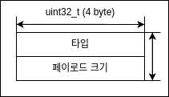

# epoll-chatting
epoll을 사용한 채팅 프로그램

## 목차
- [epoll-chatting](#epoll-chatting)
  - [목차](#목차)
  - [빌드](#빌드)
  - [실행 결과](#실행-결과)
  - [프로그램 구조](#프로그램-구조)
  - [서버의 구조](#서버의-구조)
    - [EPOLLIN 이벤트의 처리](#epollin-이벤트의-처리)
    - [EPOLLOUT 이벤트의 처리](#epollout-이벤트의-처리)
  - [클라이언트의 구조](#클라이언트의-구조)
  - [개발하면서 주의했던 부분들](#개발하면서-주의했던-부분들)
    - [SIGPIPE 시그널의 처리](#sigpipe-시그널의-처리)
      - [1. SIGPIPE 시그널을 무시하는 시그널 핸들러 함수 설치](#1-sigpipe-시그널을-무시하는-시그널-핸들러-함수-설치)
      - [2. send시에 MSG\_NOSIGNAL 플래그를 적용](#2-send시에-msg_nosignal-플래그를-적용)
    - [소켓의 송수신 처리](#소켓의-송수신-처리)
      - [블로킹 소켓의 송수신 처리](#블로킹-소켓의-송수신-처리)
      - [논블로킹 소켓의 송수신 처리](#논블로킹-소켓의-송수신-처리)
    - [EINTR 예외 처리](#eintr-예외-처리)
  - [개발하면서 했던 고민들](#개발하면서-했던-고민들)
    - [안전하게 스레드 종료하기](#안전하게-스레드-종료하기)
    - [클라이언트 프로그램 종료 시 recv()함수의 블로킹 문제](#클라이언트-프로그램-종료-시-recv함수의-블로킹-문제)
      - [1. shutdown()함수를 호출해서 read 버퍼를 닫는다.](#1-shutdown함수를-호출해서-read-버퍼를-닫는다)
      - [2. 타임아웃을 설정해서 블로킹 모드를 빠져나온다.](#2-타임아웃을-설정해서-블로킹-모드를-빠져나온다)
  - [앞으로 더 해볼 것들](#앞으로-더-해볼-것들)


## 빌드
```shell
$ make
```

## 실행 결과
클라이언트1
```shell
chatting server(127.0.0.1:56562) connect success!
> client3
> client2
client1
> client1
/exit
```

클라이언트2
```shell
chatting server(127.0.0.1:56562) connect success!
> client3
client2
> client2
> client1
/exit
```

클라이언트3
```shell
chatting server(127.0.0.1:56562) connect success!
client3
> client3
> client2
> client1
/exit
```

서버
```shell
./server 
Server opened: (0.0.0.0:56562)
[./src/server.c/accept_socket:301] accept(): add socket = 5
[./src/server.c/recv_complete:419] client(5) heartbeat:  2024. 04. 17. (Wed) 15:39:42 KST(GMT+0900)
[./src/server.c/recv_complete:419] client(5) heartbeat:  2024. 04. 17. (Wed) 15:39:49 KST(GMT+0900)
[./src/server.c/accept_socket:301] accept(): add socket = 7
[./src/server.c/recv_complete:419] client(7) heartbeat:  2024. 04. 17. (Wed) 15:39:51 KST(GMT+0900)
[./src/server.c/recv_complete:419] client(5) heartbeat:  2024. 04. 17. (Wed) 15:39:56 KST(GMT+0900)
[./src/server.c/recv_complete:419] client(7) heartbeat:  2024. 04. 17. (Wed) 15:39:58 KST(GMT+0900)
[./src/server.c/recv_complete:419] client(5) heartbeat:  2024. 04. 17. (Wed) 15:40:03 KST(GMT+0900)
[./src/server.c/accept_socket:301] accept(): add socket = 9
[./src/server.c/recv_complete:419] client(7) heartbeat:  2024. 04. 17. (Wed) 15:40:05 KST(GMT+0900)
[./src/server.c/recv_complete:419] client(9) heartbeat:  2024. 04. 17. (Wed) 15:40:05 KST(GMT+0900)
[./src/server.c/recv_complete:419] client(5) heartbeat:  2024. 04. 17. (Wed) 15:40:10 KST(GMT+0900)
[./src/server.c/recv_complete:419] client(7) heartbeat:  2024. 04. 17. (Wed) 15:40:12 KST(GMT+0900)
[./src/server.c/recv_complete:419] client(9) heartbeat:  2024. 04. 17. (Wed) 15:40:12 KST(GMT+0900)
[./src/server.c/recv_complete:425] client(9) message:  client3
[./src/server.c/recv_complete:425] client(7) message:  client2
[./src/server.c/recv_complete:419] client(5) heartbeat:  2024. 04. 17. (Wed) 15:40:17 KST(GMT+0900)
[./src/server.c/recv_complete:419] client(7) heartbeat:  2024. 04. 17. (Wed) 15:40:19 KST(GMT+0900)
[./src/server.c/recv_complete:425] client(5) message:  client1
[./src/server.c/recv_complete:419] client(9) heartbeat:  2024. 04. 17. (Wed) 15:40:19 KST(GMT+0900)
[./src/server.c/recv_complete:419] client(5) heartbeat:  2024. 04. 17. (Wed) 15:40:24 KST(GMT+0900)
[./src/server.c/recv_event:326] closeed by host (sfd=5)
[./src/server.c/recv_complete:419] client(7) heartbeat:  2024. 04. 17. (Wed) 15:40:26 KST(GMT+0900)
[./src/server.c/recv_complete:419] client(9) heartbeat:  2024. 04. 17. (Wed) 15:40:26 KST(GMT+0900)
[./src/server.c/recv_event:326] closeed by host (sfd=7)
[./src/server.c/recv_event:326] closeed by host (sfd=9)
/exit
```

## 프로그램 구조
네트워크를 공부하던 도중 "TCP는 현재 맺고 있는 연결이 잘못된 연결인지 확인하기 어렵다." 라는 말을 들었다. <br>
그래서 이를 해결하기 위해 클라이언트와의 연결 상태를 감지하는 채팅 서버를 만들기로 했다.

개발하기 전 먼저 "정말로 TCP에서 잘못된 연결을 감지하지 못할까?" 라는 생각이 들어서 검색을 해 본 결과 이를 방지하기 위해 TCP keep alives라는 옵션이 있다는 것을 알게 되었다.

다음은 TCP keep alives에 관한 설명이다.<br>
우선 설명을 간단히 하기위해 keep alive 패킷을 보내는것은 서버, 이를 받고 응답하는 것을 클라이언트라고 하겠다.

TCP 송수신이 발생하지 않는 상태를 일정 시간 유지하면 서버에서 클라이언트가 살아있는지 확인하기 위해 패킷을 보낸다.<br>
만약 클라이언트가 응답을 보내면 연결이 되어있는 것이므로 신경 쓸 게 없다. <br>
그러나 클라이언트가 응답을 보내지 않으면 연결이 되어있지 않은 것이므로 서버에서 맺고있던 연결을 끊어야 한다.<br>


그러면 tcp keep alives 옵션을 사용하면 되지 않을까? 

셸에서 다음 명령어를 통해 tcp keep alives 옵션에 대한 정보를 알 수 있다.
```shell
$ sudo sysctl -a | grep keepalive
net.ipv4.tcp_keepalive_intvl = 75   # 재전송 패킷을 보내는 주기
net.ipv4.tcp_keepalive_probes = 9   # 연결을 유지하기 위해 보내는 keepalive 패킷의 최대 재전송 횟수
net.ipv4.tcp_keepalive_time = 7200  # 송수신이 없어도 7200초(2시간) 동안 연결을 유지한다.
```
이는 7200 + 75 * 9 = 7885초 = 2시간 11분 15초가 지나야 서버가 클라이언트와의 연결이 끊겼다는것을 감지할 수 있다는 소리다.

물론 이 옵션 값을 setsockopt()함수를 사용하여
```c
int on = 1;     /* tcp keep alives 옵션 사용 */
setsockopt(sd, SOL_SOCKET, SO_KEEPALIVE, &on, sizeof(on));
int idle = 10;  /* 송수신이 없어도 10초 동안 연결을 유지한다. */
setsockopt(sd, IPPROTO_TCP, TCP_KEEPIDLE, &idle, sizeof(idle));
int intvl = 1;  /* 재전송 패킷을 보내는 주기 */
setsockopt(sd, IPPROTO_TCP, TCP_KEEPINTVL, &intvl, sizeof(intvl));
int cnt = 1;    /* 연결을 유지하기 위해 보내는 keepalive 패킷의 최대 재전송 횟수 */
setsockopt(sd, IPPROTO_TCP, TCP_KEEPCNT, &cnt, sizeof(cnt));
```
와 같이 바꿀 수 있지만 [rfc 1122의 4.2.3.6](https://www.rfc-editor.org/rfc/rfc1122.html#page-101)에서

> 구현자는 TCP 구현에 "keep-alives"를 포함할 수 있지만 이 관행이 보편적으로 허용되는 것은 아닙니다.<br>
> 연결 유지가 포함된 경우 애플리케이션은 각 TCP 연결에 대해 이를 켜거나 끌 수 있어야 하며 기본값은 꺼짐으로 설정되어야 합니다(MUST).

라고 명시되어 있으므로 tcp keep alives 옵션을 사용하지 않는 방향으로 개발을 하도록 했다.


이제 프로그램이 해야할 일들을 아래와 같이 정의했다.

1. 서버
    * 클라이언트 연결 시 연결 만료 타이머 설정
    * 이벤트 감지를 통해 타이머 만료 확인

2. 클라이언트
    * 서버에서 설정한 연결 만료 타이머보다 조금 빨리 잘 연결 되어있음을 증명하는 패킷 전송
  

이 일들을 순서도로 나타내면 아래와 같다.


Reference<br>
[1] [[Effective TCP/IP Prog.] 10. TCP/IP는 연결 닫기 정보를 통보하지 않는다.](https://blog.naver.com/cestlavie_01/221190445329)<br>
[2] [Linux TCP Keepalive 정리](https://seungjuitmemo.tistory.com/337)<br>
[3] [System Engineering 리뷰 (2) TCP](https://velog.io/@youngerjesus/System-Engineering-%EB%A6%AC%EB%B7%B0-2-TCP)<br>
[4] [Does a TCP socket connection have a "keep alive"?](https://stackoverflow.com/questions/1480236/does-a-tcp-socket-connection-have-a-keep-alive)<br>
[5] [Requirements for Internet Hosts -- Communication Layers](https://rfc-editor.org/rfc/rfc1122.html)<br>


## 서버의 구조
서버 프로그램의 구조는 아래와 같다.


각 이벤트 처리 구조는 다음과 같다.

### EPOLLIN 이벤트의 처리

EPOLLIN 이벤트는 감시하고 있는 파일기술자에게 read(), recv()가 가능할 때 발생한다.<br>
리스너 소켓에서는 아래와 같은 이유들로 이 이벤트가 감지된다.

 * 새로운 연결 요청이 들어왔다.

이를 처리하는 순서도는 아래와 같다.


클라이언트 소켓에서는 아래와 같은 이유들로 이 이벤트가 감지된다.

 * 클라이언트로부터 수신할 데이터가 있다.
 * 클라이언트의 연결이 끊겼다.
 * 타임아웃이 발생했다.

이를 처리하는 순서도는 아래와 같다.


### EPOLLOUT 이벤트의 처리

EPOLLOUT 이벤트는 감시하고 있는 파일기술자에게 write(), send()가 가능할 때 발생한다.<br>
이를 처리하는 순서도는 아래와 같다.


## 클라이언트의 구조
클라이언트 프로그램의 구조는 아래와 같다.


## 개발하면서 주의했던 부분들

### SIGPIPE 시그널의 처리

SIGPIPE 시그널에 대한 처리를 하지 않으면 다음과 같은 문제가 생길 수 있다.

```text
연결이 끊어진 소켓에 데이터를 송신
-> SIGPIPE 시그널 발생
-> SIGPIPE 시그널의 기본 동작은 프로그램의 종료이므로 프로그램 종료
```

이를 해결하기 위해서는 다음과 같은 처리를 해줘야 한다.
#### 1. SIGPIPE 시그널을 무시하는 시그널 핸들러 함수 설치
프로그램 시작 시에 다음과 같은 SIGPIPE 시그널을 무시하는 핸들러 함수를 설치한다.
```C
void sigpipe_ignore(void)
{
    struct sigaction action;

    action.sa_handler = SIG_IGN;
    if (sigemptyset(&action.sa_mask) < 0)
        unix_error("sigemptyset");
    action.sa_flags = SA_RESTART;

    if (sigaction(SIGPIPE, &action, NULL) < 0)
        unix_error("sigaction");
}
```
#### 2. send시에 MSG_NOSIGNAL 플래그를 적용
sned 함수 호출 시에 MSG_NOSIGNAL 플래그를 적용하면 시그널을 발생 시키지 않는다. <br>
(단 send시에 매번 MSG_NOSIGNAL 플레그를 적용해야 한다.)
```c
send(fd, buffer, n, MSG_NOSIGNAL);  /* 시그널을 발생 시키지 않음 */
```

### 소켓의 송수신 처리

#### 블로킹 소켓의 송수신 처리
send(), recv()는 송수신에 성공한 바이트 수를 반환한다. 

이는 send, recv 버퍼의 크기가 송수신 하고싶은 데이터의 크기보다 작거나, <br>
네트워크가 혼잡해서 일부만 송수신 되는 등 여러가지 이유로 원래 송수신을 하려고 했던 바이트 수와 다를 수 있다.

따라서 아래와 같이 함수의 반환 값을 확인해서 데이터를 모두 송수신됐는지 확인 해야한다.
```c
int recv_data(int fd, void *buf, const size_t n, int flag)
{
    int n_recv;
    int offset = 0;
    while (offset < n)
    {
        if ((n_recv = (int)recv(fd, buf, n, flag)) < 0>)
        {
            /* 오류 처리 */
            perror("recv");
            break;
        }
        else if (n_recv == 0)   /* 연결 종료 */
        {
            break;
        }
        else
        {   
            /* offset 업데이트 */
            offset += n_recv;
            n -= n_recv;
            data += offset;
        }
    }

    return 0;   /* recv 성공 */
}
```
TCP는 스트림 지향성의 특성을 가지므로 내가 송수신할 패킷의 크기를 알아야 한다.<br>
그래서 아래와 같이 프로토콜을 설계했다.

1. 기본 헤더



2. 메시지 타입


#### 논블로킹 소켓의 송수신 처리
논블로킹 모드에서는 블로킹이 발생할 수 있는 상황이 생기면 -1을 반환하고 errno를 EAGAIN로 설정한다.<br>
errno가 EAGAIN인 경우는 송수신할 데이터가 없는 경우 이므로 송수신 가능 이벤트를 등록 후 이벤트가 발생할 때 까지 다른 작업을 하는 것이 좋다.
```c
int recv_data(int fd, void *buf, const size_t n, int flag)
{
    int n_recv;
    int offset = 0;
    while (offset < n)
    {
        if ((n_recv = (int)recv(fd, buf, n, flag)) < 0>)
        {
            /* 오류 처리 */
            if (errno == EAGAIN && errno == EWOULDBLOCK)
                break;

            perror("recv");
            break;
        }
        else if (n_recv == 0)   /* 연결 종료 */
        {
            break;
        }
        else
        {   
            /* offset 업데이트 */
            offset += n_recv;
            n -= n_recv;
            data += offset;
        }
    }

    return 0;   /* recv 성공 */
}
```
(간혹 어떤 시스템에서는 errno를 EAGAIN대신에 EWOULDBLOCK으로 설정할 때가 있다.<br>
따라서 호환성을 위해서는 조건문을 errno == EAGAIN || errno == EWOULDBLOCK 로 설정하는것이 좋다.)

비동기 논블로킹 소켓을 처리하는 경우 지금 송수신 중인 패킷이 어디까지 진행 되었고, 어디서부터 진행 되어야 할지 알아야 한다.<br>
그래서 아래와 같은 packet 구조체를 설계하였다.

1. 패킷 구조체


1. data


각 필드는 다음을 의미한다.
 * offset: 패킷의 오프셋 offset == packet_size -> 수신 완료!
 * data size: 패킷 크기 (헤더 + 패이로드)
 * data: (헤더 + 패이로드)

### EINTR 예외 처리
recv(), send(), epoll_wait() ...등과 같은 블로킹 함수를 호출하는 중 인터럽트가 발생하면 이 함수들은 -1을 반환하고 errno를 EINTR로 설정한다.<br>
이 경우 recv(), send()는 데이터를 읽거나 쓰지 못하고 epoll_wait()는 이벤트 발생을 감지하지 못한다.<br>
그러므로 errno가 EINTR이면 아래와 같이 이 함수를 다시 실행하는 로직이 필요하다.
```c
int recv_data(int fd, void *buf, const size_t n, int flag)
{
    int n_recv;
    int offset = 0;
    while (offset < n)
    {
        if ((n_recv = (int)recv(fd, buf, n, flag)) < 0>)
        {
            /* 오류 처리 */
            if (errno == EINTR)
                continue;
            else if (errno == EAGAIN && errno == EWOULDBLOCK)
                break;

            perror("recv");
            break;
        }
        else if (n_recv == 0)   /* 연결 종료 */
        {
            break;
        }
        else
        {   
            /* offset 업데이트 */
            offset += n_recv;
            n -= n_recv;
            data += offset;
        }
    }

    return 0;   /* recv 성공 */
}
```
하지만 이 방식은 인터럽트가 계속 발생하면 잠재적인 무한루프를 할 수 있는 가능성이 있다.<br>
그러므로 시도 횟수를 제한해서 잠재적인 무한루프가 발생할 수 있는 가능성을 없애야 한다.

이를 구현하면 다음과 같다.
```c
int recv_data(int fd, void *buf, const size_t n, int flag)
{
    int n_recv;
    int offset = 0;
    while (offset < n)
    {
        if ((n_recv = (int)recv(fd, buf, n, flag)) < 0>)
        {
            /* 오류 처리 */
            if (errno == EINTR)
            {
                retry_cnt++;
                if (retry_cnt <= MAX_RETRY_CNT)
                    continue;
                else
                    fprintf(stderr, "recv: too many retry!\n");
            }
            else if (errno == EAGAIN && errno == EWOULDBLOCK)
            {
                break;
            }
            else
            {
                perror("recv");
                break;
            }
        }
        else if (n_recv == 0)   /* 연결 종료 */
        {
            break;
        }
        else
        {   
            /* offset 업데이트 */
            offset += n_recv;
            n -= n_recv;
            data += offset;
        }
    }

    return 0;   /* recv 성공 */
}
```

## 개발하면서 했던 고민들

### 안전하게 스레드 종료하기
처음에는 아래와 같은 구조로 스레드 함수를 작성하였다.
```c
void *worker(void *param)
{
    thread_arg *arg = (thread_arg *)param;

    while (1)
    {
        pthread_mutex_lock();

        if (queue_empty())
            pthread_cond_wait();

        item = queue_dequeue();

        pthread_mutex_unlock();

        /* processing */
    }

    /* pthread_cancel() 호출 시 여기 부터는 실행 안 됨 */
    release_resource(resource); /* ex) mutex unlock */

    pthread_exit(NULL);
}
```
위의 구조에서 스레드를 종료하려면 pthread_cancel()함수를 써서 종료해야한다.<br>
pthread_cancel()함수는 스레드를 강제로 종료하기 때문에 위 코드에서 release_resource() 함수는 호출되지 못한다.

이를 해결하려면 pthread_cleanup_push(), pthread_cleanup_pop() 함수를 이용해서 스레드 종료 전에 자원을 해제하는 함수를 등록해야 한다. <br>
아래는 이를 간단히 구현한 예제이다.
```c
void *worker(void *param)
{
    pthread_cleanup_push(release_resource, resource);   /* ex) mutex unlock */
    
    thread_arg *arg = (thread_arg *)param;

    while (1)
    {
        pthread_mutex_lock();

        if (queue_empty())
            pthread_cond_wait();

        item = queue_dequeue();

        pthread_mutex_unlock();

        /* processing */
    }

    /* pthread_cancel() 호출 시 여기 부터는 실행 안 됨 */
    pthread_cleanup_pop(0);

    pthread_exit(NULL);
}
```

하지만 pthread_cancel()은 어느 시점에 스레드가 종료할 수 있을 것인지를 결정하기 불가능하다.<br>
그래서 아래와 같이 스레드의 상태값을 이용해서 종료 후 pthread_join()을 하는 방향으로 코드를 작성했다.
```c
void *worker(void *param)
{
    thread_arg *arg = (thread_arg *)param;

    while (arg->state == RUNNING)
    {
        pthread_mutex_lock();

        if (queue_empty())
            pthread_cond_wait();

        item = queue_dequeue();

        pthread_mutex_unlock();

        if (arg->state == RUNNING)
            /* processing */
    }

    release_resource(resource); /* ex) mutex unlock */

    pthread_exit(NULL);
}
```
이 스레드를 종료시키는 코드는 다음과 같다.
```c
int thread_cleanup(thread_arg *arg)
{
    /* 스레드의 상태를 running 에서 stop으로 변경 */
    arg->state = STOP;

    /* 스레드가 cond_wait 상태면 브로드 캐스팅을 스레드를 깨움 */
    pthread_cond_broadcast();

    /* 스레드 join */
    pthread_join(arg->tid);

    return 0; /* 종료 성공 */
}
```
이렇게 안전한 스레드 종료를 구현했다.


### 클라이언트 프로그램 종료 시 recv()함수의 블로킹 문제
클라이언트는 간단히 블로킹 소켓을 사용해서 구현했다.<br>
처음 내가 기대했던 동작은 read() -> close() -> read()에서 EBADF 오류 발생 -> 스레드 종료 -> 프로그램 종료 였다.<br>
그런데 close()를 호출했음에도 recv()가 여전히 블로킹이 상태에 있어서 서버에서 연결을 끊어줘야 프로그램이 종료가 되는 문제가 발생했다.<br>

디버깅 끝에 문제가 발생한 원인을 알게 됐고, 아래는 문제 발생 원인을 그림으로 나타낸 것이다.


이 문제는 크게 2가지 방법으로 해결할 수 있다.
#### 1. shutdown()함수를 호출해서 read 버퍼를 닫는다.
```c
shutdown(sd, SHUT_RDWR);
```
#### 2. 타임아웃을 설정해서 블로킹 모드를 빠져나온다.
타임아웃을 설정하는것도 2가지 방법이 있다.
1. setsockopt()함수를 사용한 타임아웃 옵션 설정
```c
/* linux */
struct timeval tv_timeout = { .tv_sec = 1, .tv_usec = 0 };  /* 1초 */
setsockopt(sd, SOL_SOCKET, SO_RECVTIMEO, &tv_timeout, sizeof(tv_timeout));
/* windows */
int timeout_ms = 1000;  /* 1초 */
setsockopt(sd, SOL_SOCKET, SO_RECVTIMEO, &timeout_ms, sizeof(timeout_ms));
```
2. 이벤트 감지

step 1. 소켓 파일 기술자를 이벤트 감시 객체에 등록한다.<br>
step 2. 멀티플랙싱 함수를 사용해서 기다리고 싶은 시간동안 소켓 파일 기술자를 감시한다.<br>
step 3. 멀티플랙싱 함수가 반환하면 이벤트가 발생했는지 확인한다.<br>
step 4. 이벤트가 발생했으면 작업을 하고, 발생하지 않았으면 타임아웃이 발생했을 때 할 작업을 한다.<br>

이를 코드로 구현하면 아래와 같다.
```c
int recv_timeout(int fd, void *buffer, size_t n, int flags, int timeout_ms)
{
    /**
     * 1s = 1000 ms = 1000000us
    **/
    long sec = timeout_ms / 1000;
    long usec = (timeout_ms % 1000) * 1000;
    
    fd_set set;

    FD_ZERO(&set);
    FD_SET(fd, &set);
    
    struct timeval tv = { .tv_sec = sec, .tv_usec = usec };
    
    if (select(fd + 1, &set, NULL, NULL, &tv) < 0)
        perror("select");
    
    if (FD_ISSET(fd, &set))
        return recv_data(fd, buffer, n, flags);

    return -1;  /* time out */
}
```
## 앞으로 더 해볼 것들
1. 서버 부하 테스트 하기
2. openSSL 라이브러리를 사용해서 암호화 통신 하기
